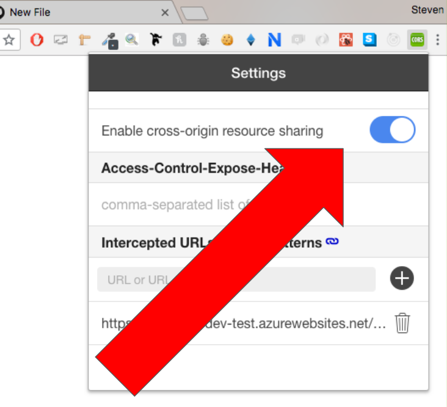
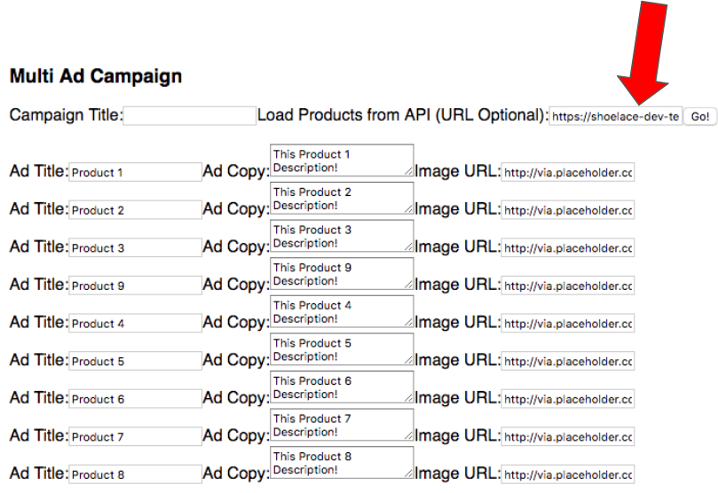

# Welcome to the Ad Campaign Creator!

- built with the MERN stack 
- repo contains both the front-end and back-end

### Getting Started

1) Navigate to the `front_end` directory -> perform an `npm install` -> `npm start` to load the front end panel (this will use port 3000).
2) Navigate to the `back_end` directory -> perform an `npm install` -> `node index.js` to start Node server (this will use port 3050).
3) **OPTIONAL** For data persistence, make sure MongoDB is running on `localhost`. The `save` button persists the current form data to MongoDB.

### Assumptions
- No 'Access-Control-Allow-Origin' header is present on the provided API (https://shoelace-dev-test.azurewebsites.net/api/UserProducts) not setup for CORS
  - **Fix**: Installed "Allow-Control-Allow-Origin" Chrome extension
  
  
  
  - Entering the API's URL into `Load Products from API` and clicking `Go!` will populate form with the respective JSON data
  
  
  
- Ad images are hosted so only their URL needs to be saved in text form
- Products prices are pulled from the API but not displayed on the front end
- Template type and campaign objective are not related
  - for example, a Single Image Ad's default Campaign Objective would be "LeadGeneration" but this can be changed
- The `publish` functionality makes a POST request to a made-up endpoint

